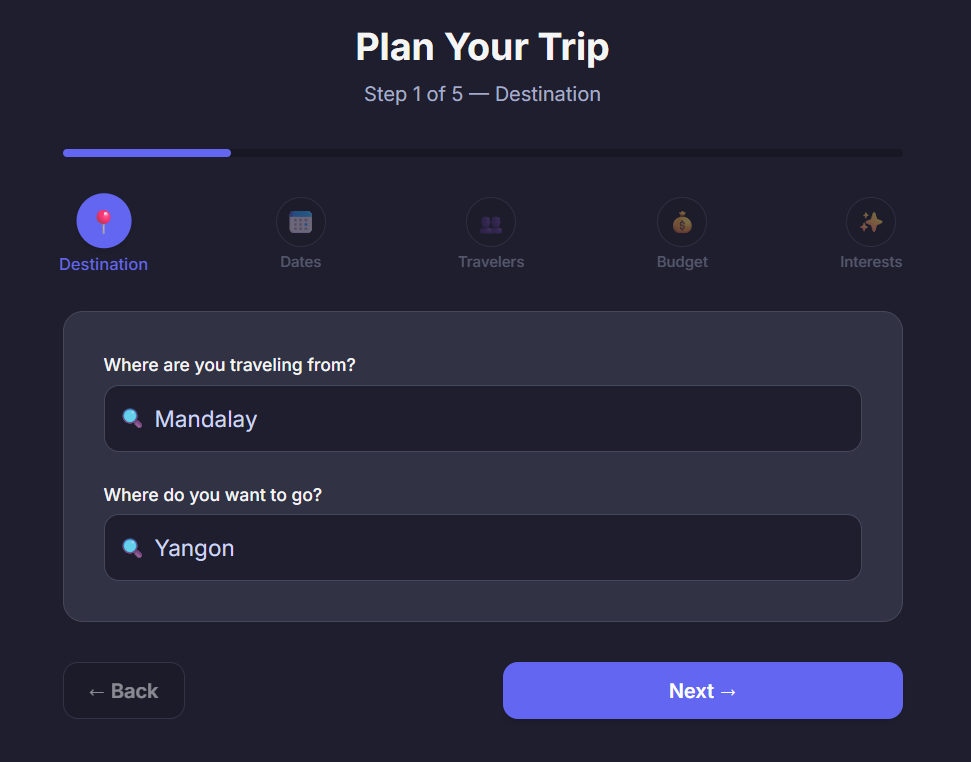
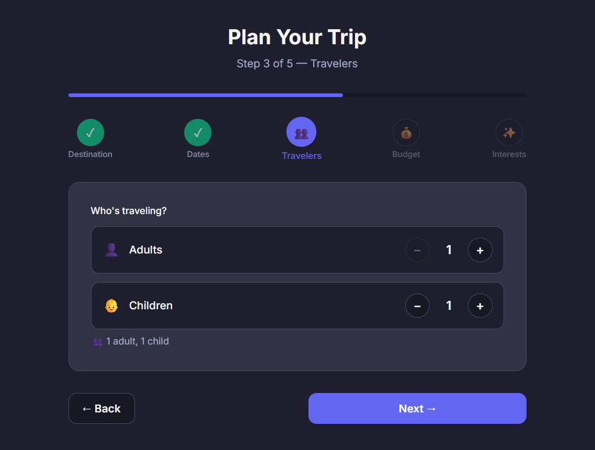
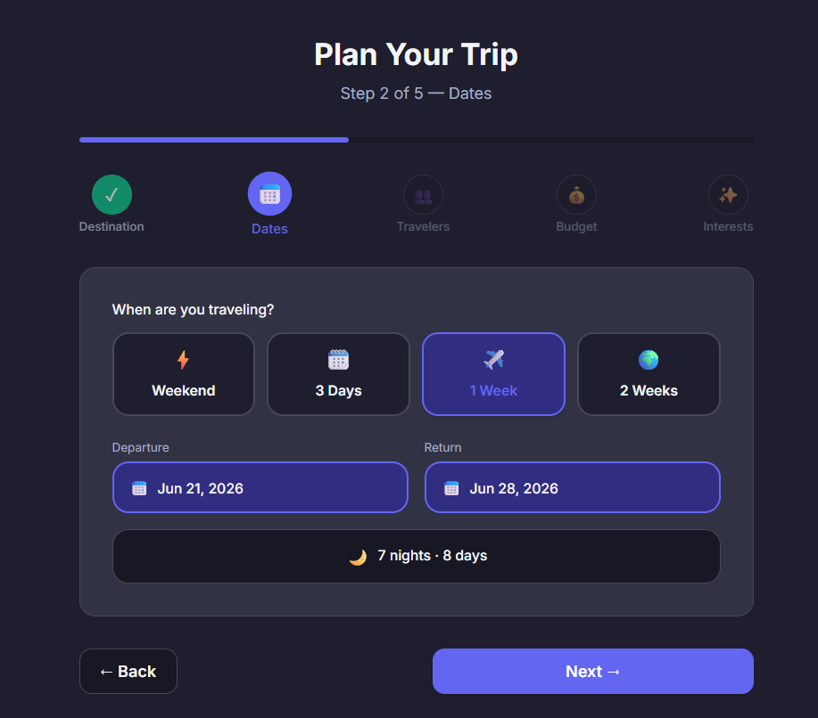
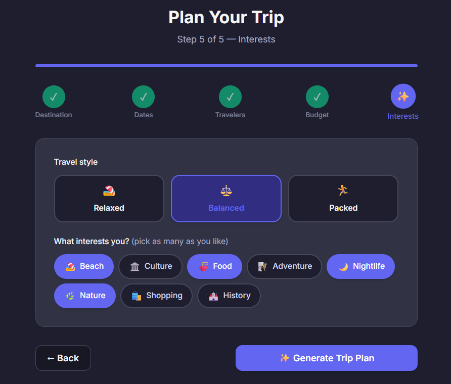
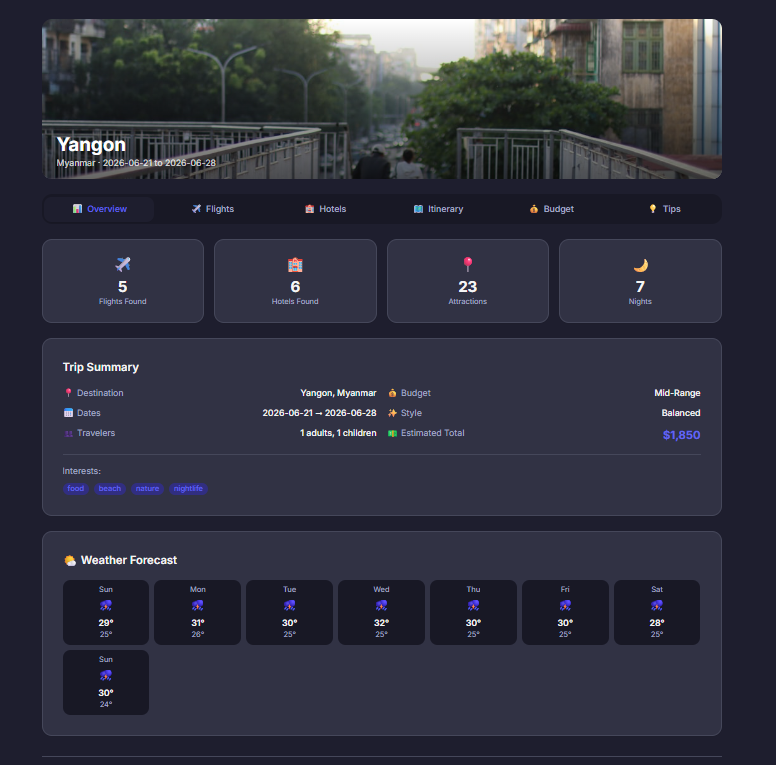
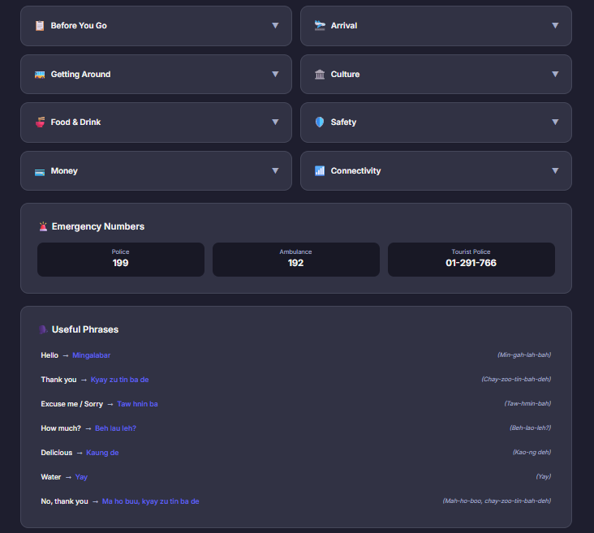

# TripGenie ✈️

A smart travel planning assistant that helps you plan your perfect trip with AI-powered recommendations for destinations, flights, hotels, and itineraries.

## Features

- 🔍 **Destination Search** — Find and compare destinations based on climate, activities, budget, and season
- ✈️ **Flight Finder** — Search and compare flight options by route, dates, and cabin class
- 🏨 **Hotel Search** — Discover accommodations tailored to your budget and preferences
- 📋 **Itinerary Builder** — Generate day-by-day trip plans with activities, transit, and meal suggestions
- 💰 **Budget Estimator** — Get detailed cost breakdowns with savings tips
- 💡 **Travel Tips** — Receive destination-specific advice on culture, packing, and safety

## Tech Stack

| Category | Technology |
|----------|------------|
| Framework | React 19 |
| Build Tool | Vite 8 |
| Routing | React Router v7 |
| Styling | Tailwind CSS 4 |
| Linting | ESLint 10 |
| Language | JavaScript (JSX) |

## Screenshots

### Home Page


### Choose Destination


### Choose Travelers


### Choose Date


### Travel Plan Overview


### Budget


### Result Overview


### Tips & Useful Phrases


## Installation

### Prerequisites

- Node.js 18+ (LTS recommended)
- npm 9+ or yarn or pnpm

### Setup

1. Clone the repository:
   ```bash
   git clone https://github.com/yourusername/tripgenie.git
   cd tripgenie
   ```

2. Install dependencies:
   ```bash
   npm install
   ```

3. Start the development server:
   ```bash
   npm run dev
   ```

4. Open your browser and navigate to `http://localhost:5173`

## How It Works

TripGenie uses AI agents to help you plan trips:

1. **Search** — Enter your destination, travel dates, and preferences
2. **Explore** — Browse curated recommendations for flights, hotels, and activities
3. **Plan** — Generate a detailed day-by-day itinerary tailored to your interests
4. **Budget** — Get a comprehensive cost estimate with money-saving suggestions
5. **Tips** — Receive practical travel advice specific to your destination

### AI Agents

The app leverages specialized agents for different planning tasks:

- `research-agent` — Gathers destination info, flight routes, and accommodation options
- `budget-agent` — Creates cost breakdowns and suggests savings
- `itinerary-agent` — Builds realistic day-by-day trip plans
- `tips-agent` — Provides cultural norms, packing essentials, and safety guidance

## Available Scripts

| Command | Description |
|---------|-------------|
| `npm run dev` | Start Vite dev server with HMR |
| `npm run build` | Build production bundle to `dist/` |
| `npm run preview` | Preview production build locally |
| `npm run lint` | Run ESLint on all files |

## Project Structure

```
tripgenie/
├── public/              # Static assets (favicon, icons)
├── src/
│   ├── assets/          # Images and media
│   ├── components/      # Reusable UI components
│   ├── context/         # React context providers
│   ├── hooks/           # Custom React hooks
│   ├── pages/           # Page components
│   ├── services/        # API and external services
│   ├── utils/           # Helper functions
│   ├── App.jsx          # Root component
│   ├── App.css          # Component styles
│   ├── index.css        # Global styles
│   └── main.jsx         # Entry point
├── index.html           # HTML template
├── package.json         # Dependencies and scripts
└── vite.config.js       # Vite configuration
```

## License

MIT
