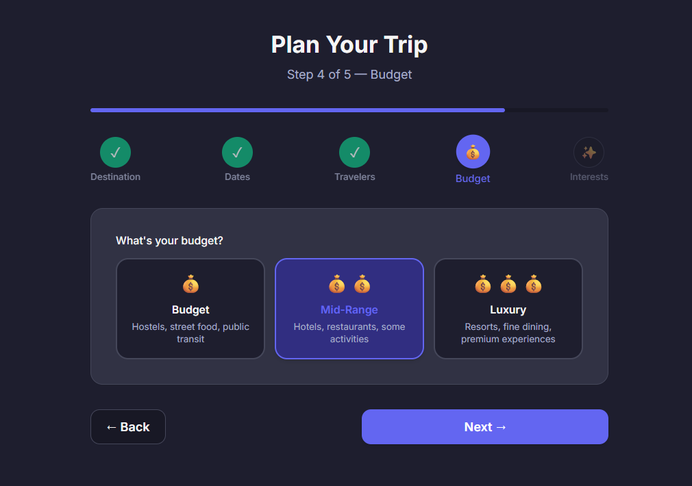

# TripGenie ✈️

## AI-powered travel planning — from idea to itinerary in minutes

---

# The problem

- Travel planning means **10+ browser tabs** — flights, hotels, activities, budgets
- Hard to estimate real costs before you book
- Local tips and cultural insights are scattered across blogs and forums
- Putting it all together into a day-by-day plan takes hours

---

# What TripGenie does

- **Search destinations** by climate, activities, budget, and season
- **Compare flights & hotels** in one place
- **Generate day-by-day itineraries** with activities, transit, and meals
- **Estimate costs** with category breakdowns and savings tips
- **Get local tips** — cultural norms, packing lists, useful phrases

One app. One plan. Zero tab overload.

---

<!-- _class: shot -->


---

<!-- _class: shot -->


---

<!-- _class: shot -->


---

<!-- _class: shot -->



---

<!-- _class: shot -->


---

# How it's built

| Layer | Technology |
|-------|------------|
| Frontend | **React 19** |
| Build tool | **Vite 8** |
| Routing | **React Router v7** |
| Styling | **Tailwind CSS 4** |
| AI | 4 specialized agents — research, budget, itinerary, tips |

```bash
npm install && npm run dev   # → localhost:5173
```

---

# Who it's for

- **Solo travelers** who want a quick plan without the research spiral
- **Groups** splitting planning tasks — one shared itinerary
- **Budget-conscious** travelers who need cost estimates before booking
- **Anyone** who'd rather travel than plan travel

---

# Try it

- **Repo:** `github.com/Heinkhantphyoe/TripGenie`
- **Run locally:** `npm run dev`

*Built with React 19 · Vite 8 · Tailwind CSS 4 · Claude Code*
